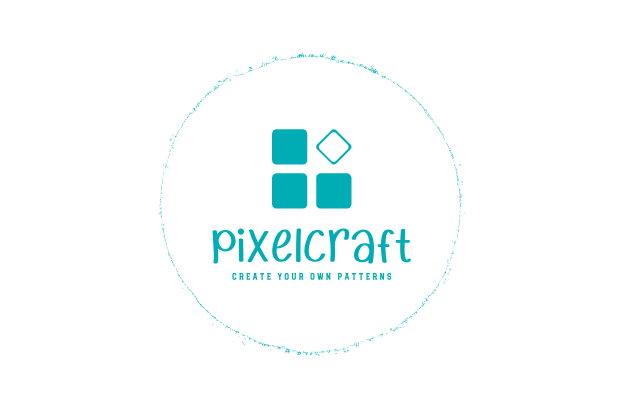

<div align="center">
  
</div>

# Pixelcraft
## Color Pattern Processing Web App

This is a web application built with Flask for processing images into color patterns. The application allows users to upload an image, choose a desired pattern type, and specify the number of colors to be used in the pattern. The processed image is displayed along with a color legend.

## Prerequisites
Create a virtual environment using Python version 3.8. This will allow you to manage dependencies and isolate your project.

Before running the application, ensure you have the following libraries installed within your virtual environment:

* Flask
* Pillow (PIL)
* OpenCV (cv2)
* NumPy (version 1.21.1 is recommended for compatibility with OpenCV)
* pandas

## Usage

1. Clone this repository to your local machine.

2. Navigate to the project directory in your terminal and activate virtual enviroment.

3. Run the Flask application:

   ```bash
   python app.py
   ```

4. Open a web browser and go to [http://localhost:5000](http://localhost:5000).

5. Use the web interface to upload an image, select a pattern type ("lego" or "thread"), and specify the desired count of pieces/stitches.

6. Click the "Upload Image" button to generate the color pattern.

7. The processed image will be displayed along with a color legend.

## How It Works

The application uses the following main steps to process an image:

1. **Image Upload**: Users can upload an image using the web interface.

2. **Cartoon Effect**: The uploaded image is processed to create a cartoon effect using edge detection, color quantization, and bilateral filtering.

3. **Pattern Processing**: Users can choose between "lego" and "thread" patterns. The pixelated image is further processed based on the selected pattern type.

4. **Legend Generation**: A legend is generated that shows the colors used in the pattern and their corresponding symbols.

5. **Display**: The processed image and color legend are displayed on the web page.

## Customization

You can customize the color patterns and processing parameters by modifying the code in `model_final.py`. The `processing_image` function in this file defines the processing steps for creating the color patterns.

## Credits

This project was independently developed by Flor Roa. It draws inspiration from various image processing techniques and libraries.
